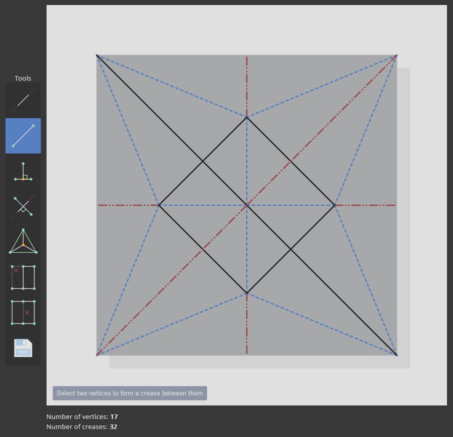

# crease
📐 A web-based crease pattern editor for origami.

<p align="center">
  
</p>

## Description

You can view the application [here](https://mwalczyk.github.io/crease/).

At its core, `crease` is a simple, vector-based line drawing tool with several geometric operations that are particularly useful for diagramming origami crease patterns. A crease pattern is essentially an embedding of a planar graph (i.e. a graph where no edges overlap). So, the primary challenge in creating such a tool is maintaining planarity throughout the lifecycle of the program. For example, if the user draws a crease that passes through one or more existing creases, the offending creases (including the one that they just created) should be "split," and new vertices should be added at the point(s) of intersection.

Each tool (described below) operates on a specific number of vertices and/or creases to perform a particular task. For example, the INCENTER tool requires the user to select 3 unique vertices. It then generates a new vertex at the incenter of the triangle formed by the 3 specified vertices. It also creates 3 new creases that emanate from the incenter outwards. Such selection mechanisms are handled by a Javascript class called an `OrderedSelection`. It is "ordered" in the sense that some tools (such as the DROP_PERPENDICULAR tool) require the user to *first* select a vertex *then* select a crease. In the future, this functionality may be redesigned to accomodate things like undo stacks, history, unordered selections, box selections, etc.

The bulk of the work is handled by the `PlanarGraph` class, which maintains a list of edges and nodes. Each node is a `Vec2` (i.e. a point in 2-space with coordinates x and y). Each edge is a pair of integer indices into the list of nodes. Nodes and edges can be added at will, and the `PlanarGraph` takes care of splitting edges, removing stray nodes (i.e. nodes with no incoming / outgoing edges), etc. One challenge with this design was figuring out how to communicate this "state" back to the rest of the application for drawing and visualization purposes. Inspired by Erik Demaine's own `cp-editor` tool, I structured the `addNode()` / `addEdge()` functions so that they each return a list of "changed" nodes and edges upon completion. The drawing code can then iterate through the list of changed objects, find the corresponding SVG elements, and modify / delete / re-add them to the canvas, as necessary. To facilitate this process, each SVG element is created with an "index" into the graph data structure. You can view these details by hovering over any crease or vertex (except for "grid vertices": the vertices that appear when the application starts).

## Tested On
- Firefox

## To Build
1. Clone this repo.
2. Make sure [npm](https://www.npmjs.com/) is installed and in your `PATH`, as well as the necessary tooling for bundling the application:
```
npm install -g browserify
npm install -g watchify
npm install --save-dev babelify @babel/core
npm install --save-dev @babel/preset-env
```
3. Inside the repo, run: `npm install` to install dependencies.
4. Finally, run: `npm run bundle`.
5. Open `index.html` in your browser.
6. During development, you can run `npm run bundle-watch` for live reloading.

## To Use

The application is fairly self-explanatory, but for completeness, each of the tools is described (in order) below:

- LINE: select two vertices to form an extended crease between them
- LINE_SEGMENT: select two vertices to form a crease between them
- DROP_PERPENDICULAR: select a vertex and a crease to drop a perpendicular crease from the vertex to the selected crease
- PERPENDICULAR_BISECTOR: select a pair of vertices to form the perpendicular bisector between them
- INCENTER: select three vertices to form creases connecting each vertex to the incenter of the corresponding triangle
- DELETE_VERTEX: delete a single vertex and all incident creases
- DELETE_CREASE: delete a single crease

Finally, the SAVE (or EXPORT) button lets you save out the crease pattern as a `.svg` file.

## To Do

This project was largely built for personal / learning purposes and isn't really meant to be a widely used tool (yet). However, it helped me get a feel for a lot of the types of geometric problems that arise when diagramming (and folding) origami. In the future, I'd like to generalize and expand upon the existing codebase to create a fuller "library" for computational origami. This might include things like: kinematic simulation, folded "layer" previews, tree theory implementation (see Robert Lang's `TreeMaker` software), etc.

- [ ] Create a REFLECTION tool: a way to select multiple vertices and/or creases and reflect (copy) them across a reference line
- [ ] Fix colinear creases bug
- [ ] Add export / import to .FOLD format
- [ ] Internalize all CSS attributes: would this make things easier or harder?
- [ ] Move code out of `index.js` into a separate class: refactor as needed
- [ ] Color themes
- [ ] More fluid mechanisms for establishing constraints (see Solidworks)
- [ ] Add undo / redo 

## Credits
This project was largely inspired by (and indebted to) Jun Mitani's Java application, [ORIPA](http://mitani.cs.tsukuba.ac.jp/oripa/) and Erik Demaine's [FOLD](https://github.com/edemaine/fold). Erik Demaine's own crease pattern editor was also a very helpful reference, especially in terms of understanding the interop between SVG elements and planar graphs.

Some other resources that were useful during the creation of this project:

1. [Calculating Perpendiculars](https://stackoverflow.com/questions/1811549/perpendicular-on-a-line-from-a-given-point)
2. [Calculating Line Segment Intersections](https://stackoverflow.com/questions/563198/how-do-you-detect-where-two-line-segments-intersect)
3. [Calculating Triangle Incenters](https://www.mathopenref.com/coordincenter.html)
4. [Calculating Line Intersections](https://rosettacode.org/wiki/Find_the_intersection_of_two_lines)
5. [Calculating Perpendicular Bisectors](https://socratic.org/questions/how-do-you-find-the-equation-of-the-perpendicular-bisector-of-the-points-1-4-and)

### License
[Creative Commons Attribution 4.0 International License](https://creativecommons.org/licenses/by/4.0/)

